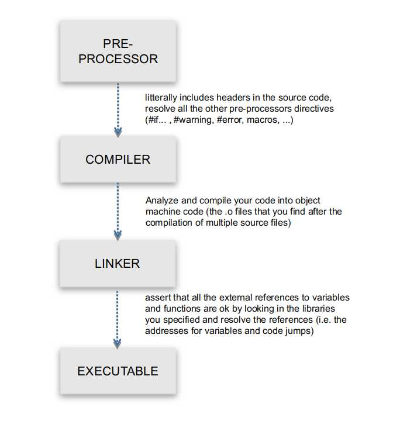
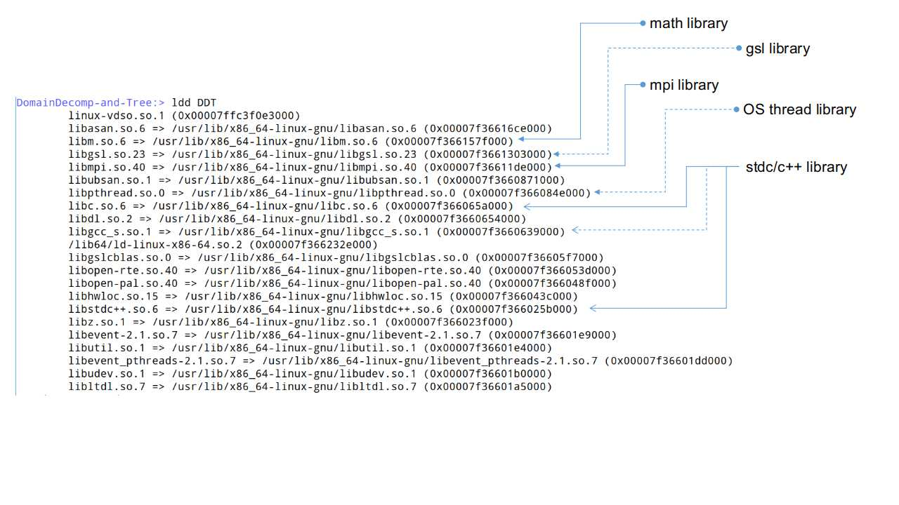
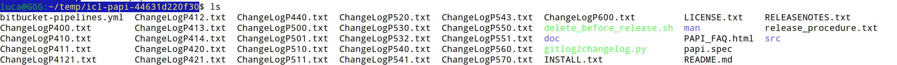

# A general (short) primary on *niX libraries with a focus on PAPI

## "how to compile a library and to love it"


### [ 1 ] What is a "library"

Exactly as the commonly-used "library" word suggests, a _library_ in this context is a collection of objects that offers access to some specialized code to perform well-defined tasks efficiently (math, I/O, graphics, videos, audio, UI, ... tons of subjects).
That is a very ubiquitous concept in all operating systems.

A Library exhibits an API (Application Public Interface) that allows any user to access its functionalities: basically, a set of functions and variables that you can call and access from within your code.
Normally, in C/C++, FORTRAN, Python or whatever, you let your compiler/interpreter knowing that you want to use that Library by "including" or "importing" a special file, provided by the library itself, that declares the interface ( the .h/.hpp file, for instance, or python modules).

When at the beginning of a C source you write

```c
#include <stdlib.h>
#include <stdio.h>
#include <math.h>
```

you are actually telling the compiler that you will use the functions and the variables that are _declared_ in those header files and that are _defined_ "somewhere else" than in your own code.
In that example, the "somewhere else" is 2 places: the C standard library and the C math library.
The content of the first one is defined in a file usually named `libstdc.so `, while the latter resides in a file usually named `libm.so`.
Those files contain object code that is very similar to the one you will obtain by compiling your own code. The difference is that you do not have to write it because it is already available, and you do not have to worry about to write your own `printf` or `cout`  routine (which would be not that easy because you would need to interact directly with the OS and the devices and so on), or your own `log` or `sin` routines, etc.

### [2] How it works

It works transparently to you. You just need to

1. tell the compiler that you want to use that library, by including the relevant header files. Be sure that the header file is findable.
   If the library is huge, usually specialized header files are provided. For instance, if you use the integration routines from the Gnu Scientific Library, you do not have to include everything:

```c
#include <gsl/gsl_math.h>
#include <gsl/gsl_integration.h>
```

is what you need

2. call the library functions and access the library variables accordingly to the API from your source code

3. tell the _linker_ what libraries you want to link to your code
4. take care that the libraries are findable by the linker and at run-time

Now we discuss shortly steps 1, 3 and 4.
Let's start with a simplified view of how the compilation process is actually shaped:



Whenever you call your compiler, like `cc -o my_exec my_source_1.c my_source_2.c ... my_source_N.c`  you are actually calling a chain of tools.
The **linker** is the last element of the chain, and takes the responsibility of linking any reference to external code and libraries that are found in your code to the appropriate address inside the right library, accordingly to what you specify.

To let the linker know what libraries you want to link to your code you must specify them by name with the standard `-l` option;
examples:

```bash
[1] cc -o my_exec source1.c source2.c -lm
[2] cc -o my_program main.c first.c second.c -lm -lmordor
```

line [1] above links the executable `my_exec` to the standard math library `libm.so`, while in the line the executable `my_program` is linked against both `libm.so` and `libmordor.so`.

As you notice, the convention is that a library is always named with a prefix `lib`: as such, the library `mordor` will reside in the file `libmordor.so` and at the command line that is specified dropping the prefix `lib`.

In general, you may link as many libraries as needed:

```c
cc -o my_proc < list of source files > -lm -lgsl -lfftw3 -lcfitsio -lhdf5 -lblas -lpthread -l...
```

> **Note:** sometimes, the linking order may be important if a library offers in its API a function that override another function in a different library. That is a special case that is usually documented in the library manual. Usually, a library does not implement function names that match with standard libraries. However, even if in limited case, in case of some strange or unexpected behaviour, take that into account as a last resort possibility.

It is possible to inspect to what library a given executable is linked against (i.e. upon which it depends) using the `ldd` utility: here below an example of a simple `mpi` program (try to inspect your `mpi_pi` from the first Assignment)



(note that the MPI compiler, which is a wrapper to the C compiler, by default links against `limpi.so`).
As you notice from the above picture even a very simple executable may be linked to a number of system libraries that offers several different services.
You also notice that the library names are not just "libsomething.so" but includes also a versioning: ```libm.so.6```, ```libhwloc.so.15```, etc. In fact, there may be different versions of a same library at the same moment on a given system and you can choose the exact one you need. By definition, by specifying only ```-lmordor``` the linker will pick up exactly the file ``libmordor.so`` : we will discuss here below where are the relevant files and which one are the default.

### [3] Where it works

Is it sufficient to specify `-lmordor` to link against the library file `libmordor.so` ?
It depends whether it is located in a _standard location_ or not: in fact in a *niX system there are some standard places where specific files are stored.
Your _filesystem_ is, broadly,  structured as follows (starting from the root `/`:

```bash
bin              # here you find the system-level binaries (i.w. executables) that are accessed by kernel/root/suser
boot             # here there are the kernel images and other files used at boot time
dev              # all the devices, which are visible as files
etc              # system-wide configuration files
home             # user area
lib              # system-level libraries
lib32            # system-level libraries compiled for 32bits
lib64            # system-level libraries compiled for 64bits
mnt              # where different partition or devices are mounted
opt              # "optional" software (tipcally some large non-standard package is put here)
proc             # you can access data on *all* the processes currently running exposed as folders and files
root             # home reserved for the root
sbin             # system-related binaries
sys              # your hardware system exposed as folders and files
usr              # everything is not strictly related to system-level functions and/or hardware and devices
var				 # diverse syste-related storage
```

The standard locations for the libraries are, typically:

```bash
/usr/lib
/usr/lib64
/usr/lib/libexec
# others.. some details may depend on the specific distribution
/lib/x86_64-linux-gnu/
```

The fact that conventionally these are standard locations does not mean that the linker knows the convention. It only means that the library files are _routinely_ placed in those folders. However, there may be, and there are, several exception. For instance, large packages placed in `/opt`, `/usr/local` or even different locations (for instance, users' `home`).

Actually, the places to be looked for by the linker are specified in two ways:

1. **through the `LD_LIBRARY_PATH` environmental variable**
   In your shell there are a number of those environmental variables (you can inquire that by using `env`). You may define your own, depending on your needs (for instance `PYTHONPATH`).
   A key variable is the `LD_LIBRARY_PATH` that is a list of folders, separated by columns: the linker will get through all those folders, starting from the first one, until it finds a library whose name matches the requested one.

   ```bash
   :> echo $LD_LIBRARY_PATH
   /home/luca/lib/:/home/luca/.local/lib:/usr/lib/:/usr/lib/x86_64-linux-gnu/:/usr/local/lib/:/opt/lib
   :> cc -o my_prog my_source.c -lmordor
   ```

   After the last line, the compiler will start from `/home/luca/lib` folder, passing to the next `/home/luca/.local/lib` if `libmordor.so` is not found and so on.
   The side effect is also that you must pay attention to this order: if there are two different `/home/luca/lib/libmordor.so` and `/opt/lib/libmordor.so` , the first one will be chosen which may not be what you want. Then pay attention to where you put your own library files, accordingly to the order that is specified in your `LD_LIBRARY_PATH`.

2. **through `-L` at the command line**
   when you specify the library file name with `-l`, you can also specify a specific location for that file:

   ```bash
   cc -o my_prog my_source.c -lm -L/opt/lib -lmordor -L/opt/speciallibs/ -lnazgul -L/usr/local/ -lgandalf
   ```

   in this example the linker will look for the `libmordor.so` file in the folder `/opt/lib`, for the `libnazgul.so` in the `/opt/speciallibs` folder and finally for `libgandalfo.so` in the  `/usr/local` location.
   Instead, `libm.so` will be searched in the locations specified in the `$LD_LIBRARY_PATH` list.

#### 3a the include files

your compiler also does expect to find the include files that you require in standard locations, like `/usr/include`. If they are in a different location, you can instruct the compiler where to search for them by using `-I`:
`cc -I/usr/unusual_location/include -I/home/${USER}/myincludes -I/opt/include ...`

### [4] .so and .a files

We have seen examples of libraries named `libsomename.so`. The suffix `.so` is used for the _Shared Objects_, i.e. for those library that are loaded in memory once and then _dynamically linked_ at run-time by all the processes that are linked against them.
There is a different type of library, less used: the _statically linked_ libraries, which have the suffix `.a` (the 'a' stands for 'archive'). These latter libraries are not just referred to at link-time, they are physically copied together with the executable.
The advantage is that you have exactly the library that you need physically together with your code. The obvious cons is the size of the resulting object.
The normal usage, at least for your current purposes, is dynamical linking against `.so` shared objects.

### [5] the typical work-flow for compiling and installing a library

Let's understand how you can compile, install and use some given library that is not present on your system. If you are the root of the system you can install it syste-wide. Otherwise, which is normally the case in a large HPC facility, you can install it on your home and link the executable against it from there.

Let's use the PAPI library as an example.

> downlad the archive file from https://icl.utk.edu/papi/software/index.html either by cloning the git repository or by downloading the zip archive.
> In the first case cd into it, in the second one unzip the archive and cd into it.

A quite standard packaging for `.tar` or `.zip` archives (so, those that do not come in the distribution-based  `.rpm` or `.deb`, or alike, containers) is the '`configure`' standard. In the case of the PAPI library (v. 6.0.0) , the following is how it looks like:



Usually here are an `INSTALL.txt` and/or a `README.txt` (or `.md`) files that contain lots of information on how to proceed. The logics is quite simple: you must configure the compiling options, compile and the install.

#### 5.a configuring

Look for an executable script named `configure` (sometimes there may be an `autoconf` or `autogen` that generates the `configure`): this is your starting point.

In this PAPI folder it is located in `./src`.
The first move is to ask for available option, which you can do by `./configure --help`.
Usually this provides a long list of options, so you may want to redirect: `./configure --help | less`.

A central option is the location that you want to assign to your library. That is controlled by the configuration option `--prefix=`

```bash
./configure --prefix=/opt/my_additional_software/
```

will install the package in the folder `/opt/my_additional_software/`.
Pay attention that you should specify the upmost level destination folder: in this case we are not indicating `/opt/my_additional_software/lib` because there are several other files that will be potentially installed. For instance, `man` entries, shared documents that go in `./shared`, executables that go in `./bin` and so on (where the `./` indicates the upmost level folder that you specify to `--prefix`).

So, if you want to install the PAPI library at standard system-wide location, as you could do on your laptop, you will type

```bash
./configure --prefix=/usr/
```

whereas if you want to install it on your home you will type

```bash
./configure --prefix=${HOME}
```

If you do not like the idea of having the `./bin`, `./shared`, `./lib`, `./man` and other folders being created in your home, you may create a dedicated folder in your home:

```bash
:> mkdir ~/Software
:> ./configure --prefix=/home/${USER}/Software
```

Asking the configure for the options, you obtain at the top lots of options about installation destination, and after that the peculiar PAPI options, with the specifications about which are default or not.

In your case, I think it is adequate the following configuration for system-wide installation on your laptop:

```bash
./configure --prefix=/usr --with-walltimer=clock_realtime --with-virtualtimer=clock_thread_cputime_id --with-perf-events
```

Just change the `--prefix` accordingly to your needs or preferences.


#### 5.b compiling

At this point, after the configure script ends (it may take a little while), still in the `./src` directory, compiling is quite easy:

`make -jN`

where `N` is an integer that ranges between 1 and your number of cores minus 1 (it just uses all your cores to compile different source files instead of making only one to compile them all).

#### 5.c installing

After the compilation ends, installing is also as easy as typing

`make install`

After that, you should find the relevant files in the expected directories.

#### 5.d using

Usage is also quite easy at this point. If you installed the library in the system-wide standard location `/usr` you can simply use the library by including the header in the you code and then compiling adding `-lpapi`.
Otherwise, if you installed it in a given $PAPIDIR, it is as easy as

`cc -I${PAPIDIR}/include -o my_prog my_source.c -L${PAPIDIR}/lib -lpapi`