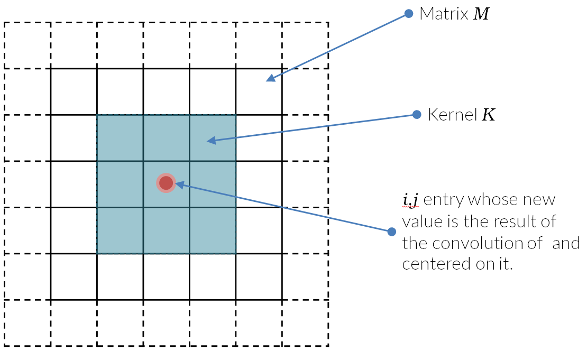
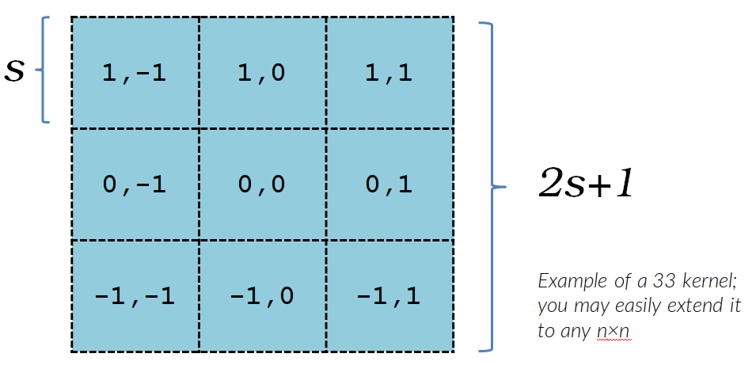
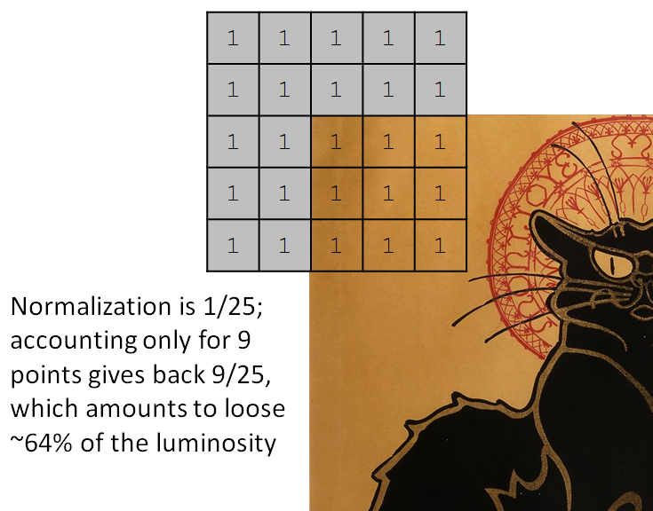
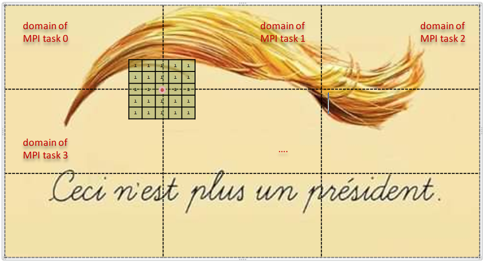

# Foundations of HPC 

# @ Data Science and Scientific Computing 2021-2022

### <font color='red'>Assignment A, to be done by students that did not submit the partial assignment in due date.</font>

<font color='red'>Note: you can choose either this assignment A or the other assignment B that you find in ../2/</font>

**In this assignment you are requested either to **
A) **implement the solution to the proposed problem both a MPI and a OpenMP code.* (so, we do expect 2 codes).**
B) **Implement the solution with an hybrid MPI+OpenMP code.**</font>


### BLURRING of an IMAGE
**In this exercise you are requested to write a code that can blur an "image", i.e. a 2D matrix**

#### - Introduction to blurring -

_Blurring_ is a very common operation in many fields; although it is commonly associated to a post-processing step in digital photography the concept is more general and applies in whatever number of dimensions.
In non-math terms, we may define the _blurring_ as the "smoothing" of a given quantity over a neighbourhood. More precisely, the _blurring_ is the result of a running convolution of a matrix $M$ with another smaller matrix $K$, often called “kernel”, over each entry of the matrix $M$:



so that each entry $M_{i,j}$ (let’s focus on 2D for the sake of simplicity, since the requirement of the exercise is in 2D) becomes
$$
M_{i,j} = \sum_{u=-s, v=-s}^{u=s,v=s} M_{i+u,j+v}\times K_{u,v}
$$
where $s$ is the integer half-size of the Kernel $K$ (consider kernel matrices that are always square and of odd order; if $k$ is its size and $s=[k/2]$ is its integer half-size, in this text we index its entries as in the above figure from $-s$ to $s$)



The requirements for the Kernel $K$ are then the following:

-  $K$ is a square matrix (_feel free to generalise to non-square kernels_)

-  $K$‘s order is always odd; 

-  $K$ is spherically symmetric respect to the entry $K_{0,0}$ (_feel free to generalise_)

-  $K$ is normalised to 1, i.e. when integrated over the volume of its support:
   $$
   \int_V K(\vec{x})d\vec{x} = 1
   $$
   which in our case translates to
   $$
   \sum_{u,v}K_{u,v} = 1
   $$
   Having a normalised Kernel leads to the _conservation_ of the quantity you’re smoothing.
   
   
   

There are obviously different Kernel types:

##### Mean Kernel 

_Aka Average Filter or Box Filter_
Using this filter amounts to equally average the pixels (the Matrix entries) around the central one and to replace it with the result. If the Kernel’s size is $k$, the Kernel matrix $K$ is then:
$$
K = \frac{1}{k^2}\begin{bmatrix}1 & 1 & \cdots & 1\\1 & 1 & \cdots & 1\\\vdots & \vdots & \ddots & \vdots \\1 & 1 & \cdots & 1\end{bmatrix}
$$
I.e., in the smaller case $k=3$
$$
K = \frac{1}{9}\begin{bmatrix}1 & 1 & 1 \\1 & 1 & 1 \\1 & 1 & 1\end{bmatrix}
$$

##### Weight Kernel

That is a generalisation of the previous one, in that the weights assigned to each pixel are no more equal. A typical example is the common centrally-weighted Kernel in which the entry $(0,0)$ holds a significant fraction $f$ of the total value and the rest $1-f$ is equally divided among the remaining entries of $K$. Using a centrally-weighted Kernel means that each pixel is dominating the new value assigned to it after the convolution.
For the sake of clarity, an example of centrally-weighted $3\times3$ Kernel is
$$
K = \begin{bmatrix}w & w & w \\w & f & w \\w & w & w\end{bmatrix}
$$
where $0<f\le1$ and $w = (1-f)/(k^2-1) = (1-f)/8$ (for instance, $f=0.52,w=0.06$).
Obviously $f=1$ means no blurring at all, which may be a good hint for a test of your code correctness.

##### Gaussian Kernel

That is a special case of the previous case, in which the weights of each entries are assigned by using a Gaussian function (in 2D in this case):
$$
G(x,y)=\frac{1}{2\pi\sigma^2}e^{-\frac{x^2+y^2}{2\sigma^2}}
$$
where $\sigma$ is the “half-size” equivalent of the half-size $s$ of the Kernel $K$. In practice since the support of $G$ is formally infinite, which would be unpractical for our purposes, you fill the $K$ entries with approximated values, like in the following classical example: 
$$
K = \frac{1}{16}\begin{bmatrix}1 & 2 & 1 \\2 & 4 & 2 \\1 & 2 & 1\end{bmatrix}
$$
(remember to always normalise the Kernel to 1).

#### - Requirements -

Then, in this exercise:

1. Consider to have a “large” input matrix $M$ of size $m\times n$ that we will call the “image” and hat the image is grey-scale (i.e. there not separate channels for different colors). For the purpose of code verification a `PGM` image will be given as input, so at least your code must be able to read in, and write out, a `PGM` file. See the [Appendix](#Appendix-I) for the details about this very simple format.
2. The precision required is of 2 bytes, i.e. a `short int` type.
3. Consider to use a square Kernel $K$ of general odd size $k$ (and half-size $s=[k/2]$).
   The minimum size is obviously $3$, and you can assume that  the conditions $k\ll m$ and $k \ll n$ are always valid.
4. Your code must be able to use different Kernels, i.e. not only the Kernel’s dimension must be a free parameter but also the Kernel type must not be hard-coded. See [here](#mean-filter) for a small discussion about Kernel types.
5. You can ignore the border effect, i.e. you are free not to process properly the border pixels for which your Kernel get out of the images’ boundaries (which results in a small clipping in luminosity, i.e. on a “vignette” effect, see below under “Clarifications”).
6. **You can avoid the in-place algorithm, which is much more complex, by using a buffer image (i.e. the blurred image can be stored in a different memory region than the original one).**
7. Your code must accept some arguments at command line, or read them from a parameter file.
   Typically, your command line could be:`./blur [kernel-type] [kernel-size] {additional-kernel-param} [input-file] {output-file}`
   where
   *`kernel-type`* is the kernel type as explained [here](#Mean-kernel). For   the sake of simplicity let’s say that the following convention holds: `Mean Kernel`$=0$, `Weight Kernel`$=1$ and `Gaussian Kernel`$=2$.
   *`kernel-size`* is the size $k$ of the kernel (so not the half-size but the entire size, which always is an odd number)
   *`{additional-kernel-param}`* while the Mean Kernel and the Gaussian Kernel are uniquely defined by their size, the Weight Kernel is not. You also need the central weight $f$; this additional parameter then is  the $f$ and must be present only when the `kernel-type` is 1.
   *`input-file`* this is obviously the input file 
   *`output-file`* this is the output file for the blurred matrix (the code should have a default filename that is assumed if no output file is specified).
8. You must provide a script `compile` that compiles the code (so you are free to decide how to name and organise the source files, whether to use or not a Makefile, and so on) and produce an executable named `blur`.

_[ Although the requirements are as stated above, feel free to generalise: you may $(i)$ represent $M$ as a floating-point matrix and translate it to the integer representation, $(ii)$ use non-square and non-symmetric Kernels, $(iii)$ treat properly the borders, $(iv)$ use coloured images (i.e. you need a triplet of values for each pixels in case of `RGB` representation or different ones in different colour-spaces). Obviously, any additional effort you make to litter some of the aforementioned simplification we’ll be positevely considered in the final examination. ]_


#### <font color='green'>- TO-DO lists - </font>

From this assignment you are request to produce:

1. 2 source codes, one using MPI and the other using OpenMP, that perform the blurring of an image as detailed above. 

2. A scalability study of your code, both weak and strong.
   -  for the strong scalability you may use the provided input test case.
   -  as for the weak scalability (i.e. a constant load per thread/task) the easiest solution is that you generate outside of your code several scaled versions of the same “image” (for instance a randomly generated matrix) and feed them to the code.
   
   You may limit the scalability to a single node of the `orfeo` cluster, depending on the availability of resources.
   
3. A performance model of your code.

4. A short report (possibly max. $\sim 5$ pages)  about your code (basically how you implemented the blurring), its scalability and the comparison with the performance model.

5. **In my scratch area on Orfeo cluster ( `/scratch/dssc/tornatore` ), which should be readable by all of you, there is an image in two version, “`earth-large.pgm`” and “`earth-notsolarge.pgm`”.**
   **Use that for testing your code against a test case more demanding than that provided if you have time.**


------

### <font color='red'>Clarifications</font>

#### <font color='red'>1. What is the “border effect”</font>

Since a picture is worth a thousand words, here it goes in an image:



The border effect is the fact that when you are centering the Kernel $K$ on pixels that are distant to the image border less than the half-size $s$, a fraction of the Kernel can not be convoluted with pixels that do not exist. However, that means that since the kernel is normalised to 1 on all its support, you are loosing some luminosity, as depicted in the figure above for the simple case of a Mean Kernel of size 5 (that is called “_vignetting_”).

However, you are authorised to ignore the need of re-normalising the Kernel at the borders.

Of course, you are not authorised to convolve the Kernel with non-existent pixels; then your code must recognise that only a part of the convolution must be performed in those situations.

#### <font color='red'>2. What the border effect is _not_ </font>

You may consider to decompose your computational domain (i.e. your matrix, or _image_) in some way, for instance as depicted here below:



The fact that inevitably you will need information from the pixels that reside on the domain of another MPI tasks is obviously part of the problem that you must solve.
So, that is **_not_** a “border effect” that you can ignore.


------


### Appendix I

#### Reading/Writing a `PGM` image

The `PGM` image format, companion of the `PBM` and `PPM` formats, is a quite simple and portable one.
It consists in a small header, written in ASCII, and in the pixels that compose the image written all one after the others as integer values. A pixel's value in `PGM` corresponds to the grey level of the pixel, in `PPM` it is a triplet of integers for `RGB` channels.
Even if also the pixels can be written in ASCII format, we encourage the usage of a binary format.

The header is a string that can be formatted like the following:

`printf( "%2s\n%d %d\n%d\n", magic, width, height, maximum_value );`

where `magic` is a magic number that is “`P4`” and "`P5`" for `PGM` and `PPM` respectively, `width` and `heigth` are the dimensions of the image in pixels, and `maximum_value` is a value smaller than `65535`.
If `maximum_value < 256`, then 1 byte is sufficient to represent all the possible values and each pixel will be stored as 1 byte. Instead, if `256 <= maximum_value < 65535`, 2 bytes are needed to represent each pixel.

In the sample file `read_write_pgm_image.c` that you find the `AdditionalAssignments/1/` folder, there are the functions `write_pgm_image()` and  `read_pgm_image()`   that you can use to respectively write and read such a file.

In the same file, there is a sample code that generate a square image and write it using the `read_write_pgm_image()` function.
It generates a vertical gradient of N~x~ x N~y~ pixels, where N~x~ and N~y~ are parameters. Whether the image is made by single-byte or 2-bytes pixels is decided by the maximum colour, which is also a parameter.
The usage of the code is as follows

```bash
cc -o read_write_pgm_image read_write_pgm_image.c
./read_write_pgm_image [ max_val] [ width height]
```

as output you will find the image `image.pgm` which should be easily rendered by any decent visualizer .

Once you have calculated the matrix $M$, to give it as an input to the function `write_pgm_image()` should definitely be straightforward.
As well, to read a `pgm` file using the `read_pgm_image()` routine should be immediate.


### Appendix II

#### A note about hybrid MPI+OpenMP

As we mentioned in the class, a simple hybridization of MPI with OpenMP is quite straightforward. As you have seen, it is obviously not a requirement but just an opportunity for those among you that like to be challenged.

As long as you use OpenMP regions in a MPI process for computation *only* and *not* to execute MPI calls, everything is basically safe and you can proceed as usual with both MPI and OpenMP calls and constructs.

At a more advanced level, the same thread that initializes an OpenMP region (i.e. the thread 0), and only that one, can make the MPI calls from within an OpenMP region (“funneled” mode).
Possibly, every thread could call MPI routines but only one at one time (“serialized” mode).
Eventually, multiple threads can make MPI calls at the same time, which is to be handled carefully (“multiple” mode).

Initialize the MPI library with a call slightly different than `MPI_Init()`:

```C

int mpi_provided_threaD_level;
MPI_Init_thread( &argc, &argv, MPI_THREAD_FUNNELED, &mpi_provided_thread_level);
if ( mpi_provided_thread_level < MPI_THREAD_FUNNELED ) {
 	printf("a problem arise when asking for MPI_THREAD_FUNNELED level\n");
    MPI_Finalize();
    exit( 1 );
}

...;   // here you go on with BaU

MPI_Finalize();
return 0;
```
